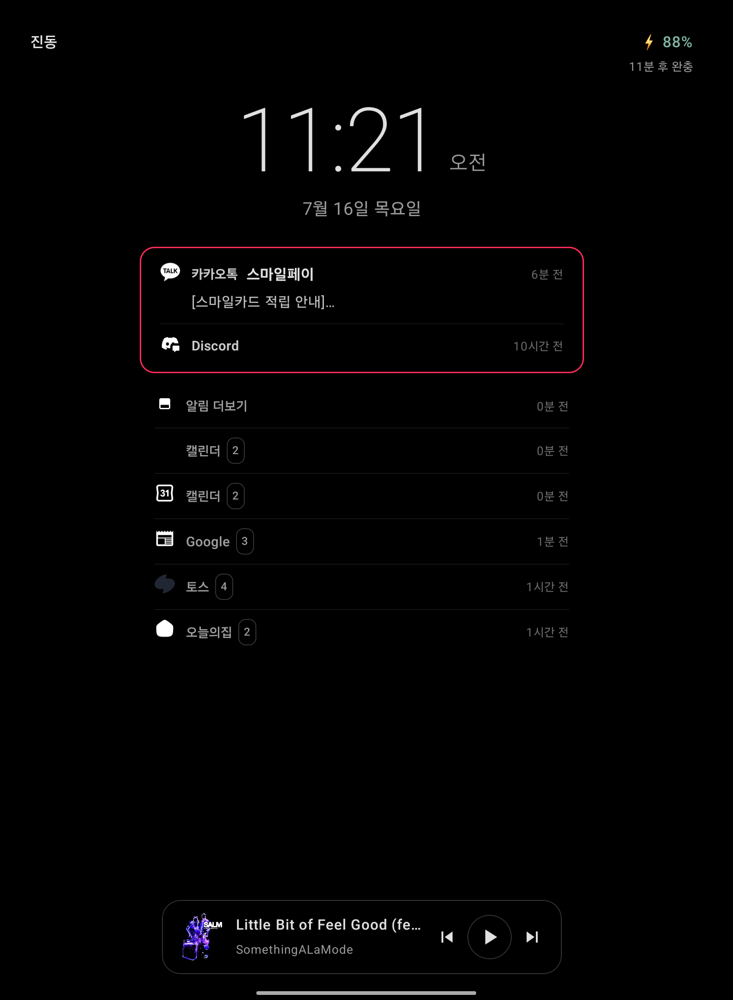
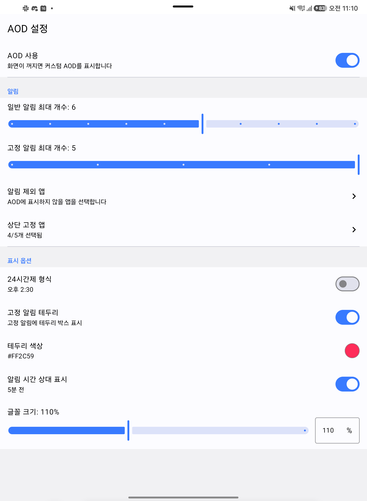

# SG AOD

Android 12 ~ 16 기기용 **커스텀 Always-On Display** 앱.

화면이 꺼지면 잠금화면 위에 시계 · 날짜 · 배터리 · 알림 · 미디어 컨트롤을 표시합니다.
순정 AOD 와 달리 알림을 **대화(채팅방/채널) 단위로 분리**해서 보여주고, 표시할 앱과
고정 앱, 글꼴 크기 등을 세밀하게 제어할 수 있습니다.

## 스크린샷

| AOD 화면 | 설정 화면 |
|:---:|:---:|
|  |  |

*고정 앱 알림 박스(테두리), 대화별 알림 분리, 앱별 개수 뱃지, 미디어 컨트롤이 표시된 모습*

## 주요 기능

- **커스텀 AOD**: 화면이 꺼지면 자동으로 표시. 시계(12/24시간제) · 날짜 · 배터리(충전 타입/완충 예상 시각) · 무음/진동/방해금지 모드
- **알림 표시**
  - 대화별 분리 — 카카오톡/Slack/Discord 등 메시징 앱은 채팅방·채널별로 별도 행 표시
  - 상단 고정 앱(최대 5개) + 하이라이트 테두리(색상 커스텀)
  - 앱별 표시 제외, 최대 개수 제한, 상대 시간("5분 전") 표시
  - 시스템의 잠금화면 알림 정책(내용 숨김/비공개) 존중
- **버튼 제어**
  - 볼륨 버튼: 완전 블랙 모드 토글 (OLED 픽셀 완전 소등 — 화면이 꺼진 것과 동일한 전력 상태)
  - 전원 버튼: AOD 종료 후 시스템 잠금화면으로 즉시 전환 (순정 AOD 의 사이드 키와 동일한 UX)
  - 더블 탭: AOD 종료
- **미디어 컨트롤**: 재생 중인 곡 정보 + 재생/일시정지/곡 이동
- **배터리/번인 최적화**
  - 순수 검정(#000000) 배경 + 저휘도 오프화이트 팔레트 (OLED 픽셀 소등)
  - 분 단위 갱신(`ACTION_TIME_TICK`), 상시 애니메이션 없음
  - 조도 센서 기반 화면 밝기 자동 조절, 픽셀 시프트(번인 방지)
- **커스터마이즈**: 글꼴 크기 50~200% (슬라이더/직접 입력), 시간 형식, 테두리 색상 등
- **외부 연동**: 삼성 루틴 · Tasker 등에서 브로드캐스트/앱 쇼트컷으로 AOD ON/OFF/토글 제어

## 요구 사항

| 항목 | 값 |
|---|---|
| **지원 Android 버전** | Android 12 ~ 16 (API 31 ~ 36) |
| **검증 환경** | Android 16 (API 36) — Samsung One UI 8.x 실기기 |
| compileSdk | 37 |
| JDK | 17 (Gradle daemon toolchain 이 자동 프로비저닝) |
| Gradle | 9.5 (wrapper 포함) |
| AGP / Kotlin | 9.3.0 / 2.4.10 |

기술 스택: Jetpack Compose (BOM 2026.06.01, Material 3) · Hilt · DataStore · Kotlin Coroutines/Flow

## 빌드 & 설치

```bash
# 디버그 빌드
./gradlew assembleDebug

# 연결된 기기에 설치
./gradlew installDebug

# 릴리스 빌드 (R8 minify + resource shrink 적용)
./gradlew assembleRelease
```

Play 스토어 배포용이 아닌 사이드로드 전용 개인 앱입니다.

### 필요 권한

첫 실행 시 앱 내 안내에 따라 아래 권한을 허용해야 합니다.

| 권한 | 용도 |
|---|---|
| 다른 앱 위에 표시 | 잠금화면 위에 AOD 액티비티 표시 |
| 알림 접근 (Notification Listener) | 알림 목록 · 미디어 세션 정보 수집 |
| 전화 상태 | 통화 중 AOD 자동 숨김 |
| 알림 표시 (Android 13+) | 포그라운드 서비스 상태 알림 |
| 배터리 최적화 제외 | 백그라운드에서 서비스 유지 (삼성 절전 대응) |

> 기기에 자체 AOD 기능이 있다면 겹치지 않도록 시스템 AOD 는 끄고 사용하세요.
> 백그라운드 제한이 공격적인 제조사 기기(삼성 등)에서는 추가로
> **설정 > 배터리 > 절전 예외 앱** 등록을 권장합니다.

## 동작 방식

### 아키텍처

Clean Architecture 3계층 (의존성 방향: Presentation → Domain ← Data):

```
app/src/main/java/dev/lutergs/sgaod/
├── data/          # Repository 구현, DataStore, 인메모리 알림 저장소
├── domain/        # 순수 Kotlin 모델 · Repository 인터페이스 · UseCase
├── presentation/  # Compose UI (AOD 화면, 설정 화면), ViewModel
├── service/       # AODService(FGS), AODNotificationListener
└── receiver/      # 부팅/외부 제어 브로드캐스트 리시버
```

### 핵심 메커니즘

**1. 화면 꺼짐 감지 → AOD 표시**
`AODService`(foreground service, `specialUse` 타입)가 `DisplayManager.DisplayListener` 로
디스플레이 상태를 감시합니다. `STATE_OFF/DOZE` 가 감지되면 `showWhenLocked` +
`turnScreenOn` 속성을 가진 `AODActivity` 를 잠금화면 위에 띄웁니다.

**2. 서비스 ↔ 액티비티 상태 동기화**
`AodVisibilityController`(`@Singleton` StateFlow)가 AOD 표시 여부의 단일 소스입니다.
브로드캐스트 기반 통지와 달리 StateFlow 는 늦게 구독해도 현재 값을 받으므로,
액티비티 생성 타이밍과 무관하게 명령 유실·상태 불일치가 발생하지 않습니다.

**3. 전원 버튼 → 잠금화면**
전원 키는 system_server 가 앱보다 먼저 소비하므로 가로챌 수 없습니다. 대신
AOD 표시 중 디스플레이가 꺼지면(= 전원 버튼) 이를 감지해 AOD 를 내리고
화면을 즉시 재점등해 시스템 잠금화면이 보이게 합니다. 같은 화면 꺼짐 이벤트가
AOD 를 "띄우는" 신호와 "끄는" 신호로 이중 해석되지 않도록 grace period 로 구분합니다.

**4. 알림 파이프라인**
`NotificationListenerService` → 인메모리 StateFlow → Compose UI 로 흐릅니다.
시스템이 리스너를 unbind 해도 `requestRebind` + AOD 표시 직전 전체 재동기화로
알림이 오래된 상태로 굳는 것을 방지합니다. 대화 분리는 `shortcutId`(Android 11+
대화 식별자) → `EXTRA_CONVERSATION_TITLE` → MessagingStyle title 순으로 판별합니다.

**5. 전력 최적화**
AMOLED 에서 검은 픽셀은 실제로 꺼지므로, 순수 검정 배경 + 점등 픽셀 최소화가
핵심입니다. 갱신은 분당 1회(`ACTION_TIME_TICK`)로 제한하고, 조도 변화는
recomposition 없이 draw 단계에서만 반영하며, 콘텐츠 전체를 분 단위로 1px 씩
이동시켜 번인을 방지합니다.

## 라이선스

개인 프로젝트로, 별도 라이선스가 지정되지 않았습니다.
